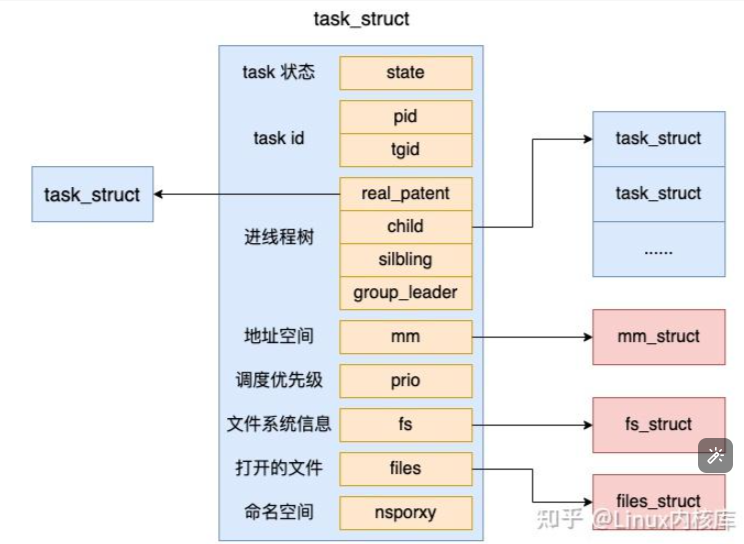

# 01-Linux进程和线程

事实在 Linux 上，进程和线程的相同点要远远大于不同点。在 Linux 下的线程甚至都被称为了轻量级进程。

内核中表示线程的数据结构。Linux 中，无论进程还是线程，都是抽象成了 task 任务，在源码里都是用 task\_struct 结构来实现的。

<figure><figcaption></figcaption></figure>

对于线程来讲，所有的字段都是和进程一样的（本来就是一个结构体来表示的）。包括状态、pid、task 树关系、地址空间、文件系统信息、打开的文件信息等等字段，线程也都有。

进程和线程的相同点要远远大于不同点，本质上是同一个东西，都是一个 task\_struct ！正因为进程线程如此之相像，所以在 Linux 下的线程还有另外一个名字，叫轻量级进程 。

在 Linux 中，每一个 task\_struct 都需要被唯一的标识，它的 pid 就是唯一标识号。

对于进程来说，这个 pid 就是我们平时常说的进程 pid。

对于线程来说，我们假如一个进程下创建了多个线程出来。那么每个线程的 pid 都是不同的。但是我们一般又需要记录线程是属于哪个进程的。这时候，tgid 就派上用场了，通过 tgid 字段来表示自己所归属的进程 ID。

<figure><figcaption></figcaption></figure>

